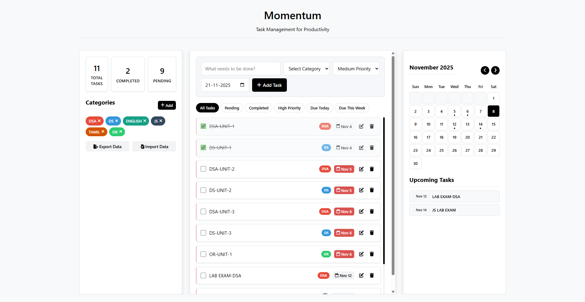

# 🌟 Momentum — Advanced Task Manager

**Momentum** is a sleek and powerful **web-based task manager** that helps you organize your day and stay productive — right inside your browser.

You can manage your tasks with **categories, priorities, and due dates**, view them on a **calendar**, and even **import/export** your data as JSON for easy backup and sharing.

> 🧠 *Innovation Lab Project — JS Lab*  
> Developed by **Aditya K**

## 🖼️ Preview

## ✨ Key Features

### ✅ Task Management
- Add, edit, or delete tasks easily.  
- Mark tasks as **completed** or **pending**.  
- Each task includes **title, category, priority, and due date**.

### 🗂️ Custom Categories
- Create and color-code your own categories (*Work*, *Personal*, etc.).  
- Edit or delete categories anytime.

### ⚡ Smart Filtering
Quickly filter tasks by:
- All / Completed / Pending  
- High Priority  
- Due Today / This Week

### 📅 Calendar View
- Interactive monthly calendar with highlighted due dates.  
- Click a date to view its tasks.

### ⏰ Upcoming Tasks
- Shows all tasks due in the **next 7 days**.

### 📊 Task Statistics
- Displays counts of **Total**, **Completed**, and **Pending** tasks.

### 💾 Local Data Storage
- All data is saved automatically in your **browser’s localStorage** — no internet required.

## 🔁 Import & Export (New Feature)

Easily back up or transfer your tasks between devices.

### 🟢 Export Data
1. Click **Export Data** in the app.  
2. A file like `momentum_backup_2025-11-08.json` will download.  
3. Save it safely (Google Drive, email, USB, etc.).

### 🟣 Import Data
1. Click **Import Data** in the app.  
2. Select your saved `.json` file.  
3. Your previous tasks and categories will be restored instantly.  

> 💡 *Perfect for backup or sharing your data across devices.*

## 🛠️ Tech Stack

| Technology | Purpose |
|-------------|----------|
| **HTML5** | Structure & layout |
| **CSS3** | Styling & responsive design |
| **JavaScript (ES6+)** | Logic, event handling, and data management |

